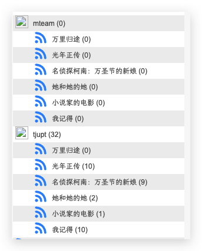

# douban-rss-to-pt-rss

将豆瓣中`想看`的影视剧自动生成pt站rss订阅链接，发送至`qbitorrent`.

##### 效果图


| **豆瓣想看列表**       | **qb rss生成效果**                      |
| ---------------------- | --------------------------------------- |
|  |                   |
|                        | 会按照`pt站/影片标题`的层级格式进行存储 |

## 需配置的环境变量

| key            | value example     | description                                                                      |
| -------------- | ----------------- | -------------------------------------------------------------------------------- |
| DOUBAN_USER_ID | 12345             | 豆瓣账号id  (可以在个人资料页找到一串数字id)                                     |
| SITES          | tjupt,mteam       | 需要搜索的pt站名，用逗号分割（[当前支持的pt站](#当前支持的pt站名)）              |
| QB_URL         | http://qb.xxx.com | qb地址                                                                           |
| QB_USER        | qbit              | qb用户名                                                                         |
| QB_PWD         | 12345             | qb密码                                                                           |
| tjupt_passkey  | 3j3oi32onf        | 各pt站的passkey，key的格式为 <pt站名>_passkey，例如 tjupt_passkey, mteam_passkey |


## 当前支持的pt站名

- tjupt
- mteam

## 运行

#### 直接运行

```shell
python3 main.py
```

#### docker运行

`docker-compose.yml`

```yaml
version: 3
```
